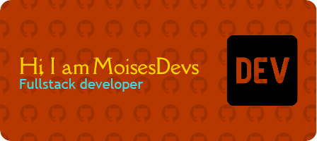

  

# Hi, I'm MoisesDev 👋

## 🧑‍💻 Junior Full Stack Developer

Building practical software solutions and growing my skills every day.

---

## 🛠️ Skills

### Languages & Technologies:

### Tools:

---

## 📫 Contact

- Email: [carlos.herrera23@itca.edu.sv](mailto:carlos.herrera23@itca.edu.sv)

---

